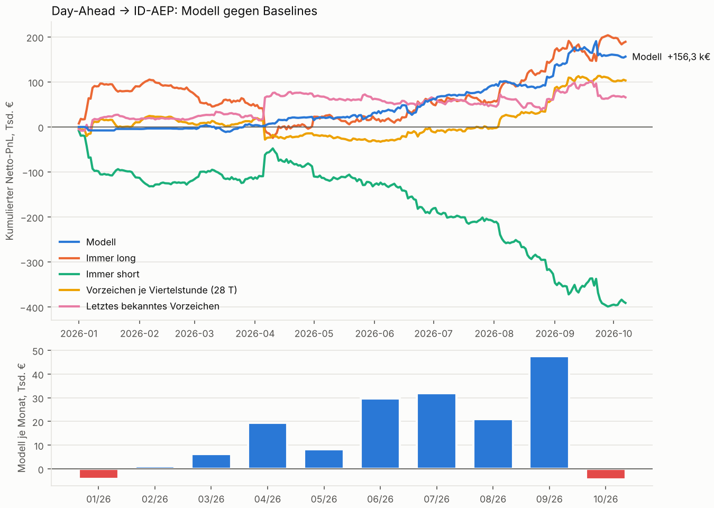

# Backtest-Report

Alle Zahlen im Detail. Die Kurzfassung steht im [README](../README.md).

Testzeitraum 2026-01-01 bis 2026-10-07 (280 Tage, walk-forward, jeder Monat out-of-sample). Position 10 MW je gehandelter Viertelstunde, Einstieg zum Day-Ahead-Preis, Ausstieg bewertet zum ID-AEP (Benchmark, kein handelbarer Preis). Kosten: 0,25 €/MWh je Seite, 1,0 €/MWh Slippage beim Ausstieg, 10 €/MWh Strafe, wenn der ID-AEP fehlt.

**Urteil nach dem vorab festgelegten Kriterium** (das Modell zählt nur, wenn es jede Baseline im Tages-PnL mit t > 2 schlägt): **nicht erfüllt**. Geschlagen: Immer short (t 3,57). Nicht geschlagen: Immer long (t -0,22), Vorzeichen je Viertelstunde (28 T) (t 0,64), Letztes bekanntes Vorzeichen (t 1,07).

- **Gewinnschwelle der Ausführung:** Das Modell verdient +4,08 €/MWh netto bei 1,0 €/MWh Slippage. Kostet der Ausstieg mehr als 5,1 €/MWh gegenüber dem ID-AEP, ist der Gewinn weg. Ob echte Ausführung das schafft, kann dieser Backtest nicht zeigen: Der ID-AEP ist ein Index, kein Preis, zu dem man handeln kann.
- **Long gegen Short:** long +171 740 € auf 23 498 MWh, short -15 405 € auf 14 835 MWh.
- **Spitzen:** ohne die 10 besten Tage bleiben +21 843 € von +156 336 €.

| Strategie | Netto € | €/MWh | MWh | Treffer | Sharpe (ann.) | t (HAC) | Max. Drawdown € | Schlechtester Tag € | ID-AEP fehlte |
|---|---:|---:|---:|---:|---:|---:|---:|---:|---:|
| **Modell** | +156 336 | +4,08 | 38 332 | 52 % | 2,62 | 2,41 | -36 555 | -31 329 | 0 |
| Immer long | +189 252 | +2,82 | 67 190 | 44 % | 1,90 | 1,38 | -129 624 | -48 138 | 0 |
| Immer short | -390 822 | -5,82 | 67 190 | 50 % | -3,93 | -2,84 | -398 874 | -30 949 | 0 |
| Vorzeichen je Viertelstunde (28 T) | +103 275 | +1,54 | 67 190 | 49 % | 1,51 | 1,25 | -57 401 | -44 370 | 0 |
| Letztes bekanntes Vorzeichen | +65 797 | +0,98 | 67 172 | 49 % | 0,88 | 0,78 | -39 963 | -27 745 | 0 |

**Modell minus Baseline**, Tages-PnL (t > 2: Vorsprung jenseits von Rauschen):

| gegen | Ø €/Tag | t (HAC) | Ø €/Tag, Spread gekappt ±200 | t |
|---|---:|---:|---:|---:|
| Immer long | -117,6 | -0,22 | +458,1 | 1,31 |
| Immer short | +1 954,1 | 3,57 | +1 285,4 | 3,81 |
| Vorzeichen je Viertelstunde (28 T) | +189,5 | 0,64 | +279,0 | 1,57 |
| Letztes bekanntes Vorzeichen | +323,4 | 1,07 | +590,7 | 3,23 |

**Spike-Abhängigkeit**: Netto-PnL in €, wenn der Spread auf ±X €/MWh begrenzt wäre (t in Klammern). Was unter der Kappung verschwindet, kam aus wenigen Preisspitzen.

| Strategie | ungekappt | davon 10 größte Viertelstunden | ohne die 10 besten Tage | ±500 | ±200 | ±100 |
|---|---:|---:|---:|---:|---:|---:|
| Modell | +156 336 | +16 840 | +21 843 | +149 444 (3,5) | +143 306 (3,9) | +120 364 (3,8) |
| Immer long | +189 252 | +26 937 | -33 820 | +99 641 (0,9) | +15 036 (0,2) | -67 739 (-0,9) |
| Immer short | -390 822 | -27 012 | -518 909 | -301 211 (-2,9) | -216 606 (-2,4) | -133 831 (-1,8) |
| Vorzeichen je Viertelstunde (28 T) | +103 275 | +26 937 | -35 965 | +70 144 (1,4) | +65 184 (1,6) | +45 334 (1,2) |
| Letztes bekanntes Vorzeichen | +65 797 | +50 803 | -115 155 | -1 471 (-0,0) | -22 089 (-0,6) | -32 758 (-0,9) |

**Kostenempfindlichkeit**: Netto-PnL in € bei Slippage (€/MWh gegenüber dem ID-AEP) von

| Strategie | 0,0 | 1,0 | 2,0 | 5,0 | Gewinnschwelle €/MWh |
|---|---:|---:|---:|---:|---:|
| Modell | +194 668 | +156 336 | +118 003 | +3 006 | 5,1 |
| Immer long | +256 442 | +189 252 | +122 062 | -79 508 | 3,8 |
| Immer short | -323 632 | -390 822 | -458 012 | -659 582 | – (verliert schon ohne Slippage) |
| Vorzeichen je Viertelstunde (28 T) | +170 465 | +103 275 | +36 085 | -165 485 | 2,5 |
| Letztes bekanntes Vorzeichen | +132 969 | +65 797 | -1 376 | -202 893 | 2,0 |

**Long- und Short-Seite** (netto €, in Klammern MWh)

| Strategie | long | short |
|---|---:|---:|
| Modell | +171 740 (23 498) | -15 405 (14 835) |
| Immer long | +189 252 (67 190) | +0 (0) |
| Immer short | +0 (0) | -390 822 (67 190) |
| Vorzeichen je Viertelstunde (28 T) | +185 879 (40 780) | -82 603 (26 410) |
| Letztes bekanntes Vorzeichen | +181 240 (31 490) | -115 443 (35 682) |

**Modell je Monat**

| Monat | Netto € | MWh | Schwelle €/MWh | Trainingstage |
|---|---:|---:|---:|---:|
| 2026-01 | -4 321 | 180 | 30 | 90 |
| 2026-02 | +1 017 | 202 | 30 | 121 |
| 2026-03 | +6 289 | 5 218 | 5 | 149 |
| 2026-04 | +19 481 | 2 538 | 10 | 180 |
| 2026-05 | +8 267 | 5 928 | 5 | 210 |
| 2026-06 | +29 692 | 6 650 | 2 | 241 |
| 2026-07 | +31 982 | 4 840 | 5 | 271 |
| 2026-08 | +20 880 | 5 172 | 5 | 302 |
| 2026-09 | +47 538 | 6 102 | 2 | 333 |
| 2026-10 | -4 490 | 1 502 | 2 | 363 |

### Robustheit: alle getesteten Varianten

Gleicher Walk-forward, gleiche Kosten. Vor dem ersten Backtest auf echten Daten stand nur die erste Version fest (erste Zeile). Danach wurde das Hauptmodell zweimal geändert: Die Lastprognose flog raus, weil ihr Veröffentlichungszeitpunkt nicht belegbar ist, und die Vorhersage ist jetzt das Mittel aus fünf Startwerten, weil ein einzelnes Modell stark am Startwert hing. Beides hat den PnL im Test erhöht. Alle anderen Varianten kamen danach, und alle stehen hier, auch die schlechten. Die beste Zeile zur Strategie zu erklären wäre Anpassung an den Testzeitraum: Die Tabelle zeigt, wie unsicher die Hauptzahl ist.

| Variante | Netto € | €/MWh | t | Spread gekappt ±200: Netto € (t) | t gegen Vorzeichen je Viertelstunde | Long € | Short € |
|---|---:|---:|---:|---:|---:|---:|---:|
| _Hauptmodell_ | | | | | | | |
| **erste Version, vor dem ersten Backtest festgelegt (mit Lastprognose, ein einzelnes Modell, Startwert 0, Schwelle 0 erlaubt)** | +101 647 | +2,67 | 1,54 | +103 278 (2,8) | -0,02 | +165 504 | -63 856 |
| **Hauptmodell: ohne Lastprognose, Mittel aus fünf Startwerten, Schwelle mindestens 2 €/MWh** | +156 336 | +4,08 | 2,41 | +143 306 (3,9) | 0,64 | +171 740 | -15 405 |
| _Datenstand_ | | | | | | | |
| mit Lastprognose | +159 374 | +3,91 | 2,18 | +134 132 (3,5) | 0,56 | +179 416 | -20 042 |
| Wetter nur so frisch wie im Archiv (vollständige Läufe auf dessen Vorlaufzeiten 24–29 h und 48–53 h zurückgeschnitten) | +139 865 | +3,51 | 2,26 | +130 577 (3,6) | 0,44 | +158 892 | -19 027 |
| ohne MW-Features (keine installierte Leistung) | +142 283 | +4,01 | 2,28 | +131 253 (3,7) | 0,48 | +160 354 | -18 070 |
| _Entscheidungsregel_ | | | | | | | |
| Schwelle 0 erlaubt (Regel bis 9. Oktober 2026) | +155 425 | +3,73 | 2,38 | +142 043 (3,8) | 0,63 | +170 265 | -14 840 |
| feste Schwelle 2 €/MWh, nichts gewählt | +152 752 | +2,59 | 1,80 | +128 300 (2,4) | 0,53 | +208 820 | -56 068 |
| Schwelle auf 56 statt 28 Tagen gewählt | +119 925 | +3,81 | 1,61 | +91 826 (2,3) | 0,20 | +170 639 | -50 714 |
| Schwelle auf allen bisherigen Out-of-sample-Tagen gewählt | +152 487 | +4,58 | 2,24 | +119 375 (3,3) | 0,62 | +186 776 | -34 289 |
| getrennte Schwellen für long und short, „nie“ erlaubt | +143 859 | +4,24 | 2,17 | +108 728 (3,0) | 0,56 | +182 550 | -38 691 |
| Größe nach Signalstärke (10–20 MW) | +318 027 | +4,70 | 2,57 | +263 190 (3,8) | 1,71 | +361 318 | -43 291 |
| _Modell_ | | | | | | | |
| Median- statt Quadratverlust | -8 467 | -0,29 | -0,16 | +51 114 (1,4) | -1,01 | +47 236 | -55 703 |
| stärker reguliert (150 Bäume, ≥ 500 Viertelstunden je Blatt) | +136 090 | +3,39 | 2,19 | +137 406 (3,7) | 0,33 | +155 738 | -19 648 |
| Trainingsziel hart auf ±100 €/MWh gekappt | +102 293 | +3,32 | 2,06 | +128 471 (4,1) | -0,01 | +115 858 | -13 565 |
| Mittel aus 5 Modellen auf Tages-Bootstraps | +156 939 | +4,28 | 2,49 | +144 319 (3,9) | 0,57 | +160 963 | -4 023 |
| zweistufig: ÜNB-Prognosefehler vorhersagen, dann in € umrechnen | +19 542 | +1,13 | 0,48 | +7 515 (0,3) | -0,95 | +42 905 | -23 363 |
| _Feature-Gruppe weggelassen_ | | | | | | | |
| ohne Wetter | -55 083 | -2,84 | -0,93 | +39 071 (1,6) | -1,82 | -101 | -54 982 |
| ohne Spread-Historie | +172 811 | +5,73 | 2,50 | +132 658 (3,9) | 0,61 | +149 866 | +22 945 |
| ohne Day-Ahead-Preise des Vortags | +194 166 | +5,80 | 2,38 | +104 326 (2,6) | 0,80 | +159 766 | +34 401 |
| _Startmonat_ | | | | | | | |
| Test ab Dezember 2025 (59 statt 60 Trainingstage verlangt) (2025-12-01 bis 2026-10-07) | +132 326 | +3,14 | 1,95 | +123 554 (3,1) | 0,60 | +161 877 | -29 551 |
| _Zufallsstartwert_ | | | | | | | |
| ein einzelnes Modell statt des Mittels, Startwert 0 | +157 308 | +4,47 | 2,54 | +127 563 (3,8) | 0,68 | +184 167 | -26 859 |
| ein einzelnes Modell statt des Mittels, Startwert 1 | +148 948 | +4,63 | 2,46 | +131 288 (3,7) | 0,49 | +157 035 | -8 087 |
| ein einzelnes Modell statt des Mittels, Startwert 2 | +52 924 | +1,58 | 0,93 | +90 397 (2,8) | -0,62 | +104 107 | -51 183 |
| ein einzelnes Modell statt des Mittels, Startwert 3 | +160 814 | +4,67 | 2,37 | +116 554 (3,1) | 0,69 | +177 158 | -16 344 |
| ein einzelnes Modell statt des Mittels, Startwert 4 | +82 642 | +2,46 | 1,58 | +102 505 (3,1) | -0,24 | +122 925 | -40 283 |
| Mittel über die Startwerte 5–9 | +187 567 | +5,10 | 2,59 | +140 112 (3,7) | 0,84 | +174 878 | +12 689 |
| Mittel über die Startwerte 10–14 | +190 745 | +4,59 | 2,64 | +150 037 (4,0) | 0,93 | +184 962 | +5 783 |

Spanne über die Varianten (ohne weggelassene Feature-Gruppen und ohne die größere Position): -8 467 bis +190 745 €.
Ein einzelnes Modell landet je nach Zufallsstartwert bei +52 924 bis +160 814 € (t 0,93 bis 2,54). So groß ist das Schätzrauschen, bevor irgendeine Designentscheidung ins Spiel kommt; deshalb mittelt das Hauptmodell fünf Startwerte.
Mittel über fünf Startwerte: 0–4 (Hauptmodell): +156 336 € (t 2,41), 5–9: +187 567 € (t 2,59), 10–14: +190 745 € (t 2,64).

### Was ein Prognosefehler kostet (ex post)

| Fehler (Ist − ÜNB-DA), je GW | €/MWh Spread | t | gekappt ±200 | t | 00-06 | 06-10 | 10-16 | 16-20 | 20-24 |
|---|---:|---:|---:|---:|---:|---:|---:|---:|---:|
| Konstante | +4,57 | 3,2 | +2,05 | 2,5 | +4,71 | +3,83 | +10,19 | +1,91 | +9,59 |
| Solar | -7,90 | -6,1 | -7,64 | -13,0 | – | -11,47 | -7,69 | -7,55 | – |
| Wind an Land | -3,81 | -1,7 | -4,79 | -5,9 | -6,18 | -8,06 | +5,00 | -7,00 | -11,06 |
| Wind auf See | -5,92 | -2,2 | -4,72 | -4,0 | -9,30 | -8,02 | -3,58 | -10,48 | -8,52 |
| Last | +0,75 | 1,1 | -0,02 | -0,1 | -0,46 | -1,08 | +1,86 | +2,42 | -0,63 |

n = 35 712 Viertelstunden, R² = 0,03, gekappt 0,12. t mit Newey-West-Standardfehlern (Lags: ein Tag). „Gekappt“: Spread auf ±200 €/MWh begrenzt, damit wenige Preisspitzen die Schätzung nicht dominieren. Spalten rechts: getrennte Regressionen je Tageszeit (ungekappt); „–“: Fehler schwankt dort zu wenig (Standardabweichung unter 250 MW) für eine sinnvolle Steigung.

### Stimmen die Zeitstempel der Wetterdaten?

Der Lookahead-Test prüft, dass der Code jedes `available_at` respektiert. Ob die Stempel selbst stimmen, lässt sich prüfen, wo das Dataset beide Arten von Prognosen hat: Archivwerte („Tag 1“ = mindestens 24 h alt, „Tag 2“ = 48 h) und vollständige Läufe (nachgeladen oder live mitgeschnitten).

| Wettermodell | Gültigkeitszeiten | Archivwert | Werte geprüft | genau einem Lauf zuzuordnen | Vorlauf dieses Laufs (min / Median / max) | frischer als behauptet |
|---|---|---|---:|---:|---:|---:|
| icon_eu | 2026-06-14 bis 2026-09-30 | Tag 1 (behauptet ≥ 24 h) | 41 712 | 41 709 | 24 / 27 / 29 h | 0 |
| icon_eu | 2026-06-14 bis 2026-09-30 | Tag 2 (behauptet ≥ 48 h) | 41 712 | 41 712 | 48 / 51 / 53 h | 0 |
| ecmwf_ifs | 2026-06-13 bis 2026-09-30 | Tag 1 (behauptet ≥ 24 h) | 41 952 | 41 759 | 24 / 27 / 41 h | 0 |
| ecmwf_ifs | 2026-06-13 bis 2026-09-30 | Tag 2 (behauptet ≥ 48 h) | 41 952 | 41 759 | 48 / 51 / 65 h | 0 |

Ein Archivwert gilt als zugeordnet, wenn er in allen Variablen, die beide Datenarten haben, exakt einem einzigen vollständigen Lauf gleicht. „Frischer als behauptet“ zählt Werte aus einem Lauf mit kürzerem Vorlauf als angegeben. Verglichen wird fast nur mit nachgeladenen Läufen, denn das Archiv endet, kurz nachdem der Live-Mitschnitt beginnt. Die live mitgeschnittenen Läufe liefern dafür die gemessene Veröffentlichungszeit.
Gemessen: icon_eu 2,9 bis 4,2 h nach Laufstart (75 Läufe; das Archiv setzt 4,5 h an); ecmwf_ifs 6,1 bis 7,5 h nach Laufstart (39 Läufe; das Archiv setzt 8,5 h an).

Gerechnet am 2026-10-09 11:31 UTC, Code 8caf547, Wetterdaten akderekaan/de-power-forecast-data @ db6bf7f0f358.
